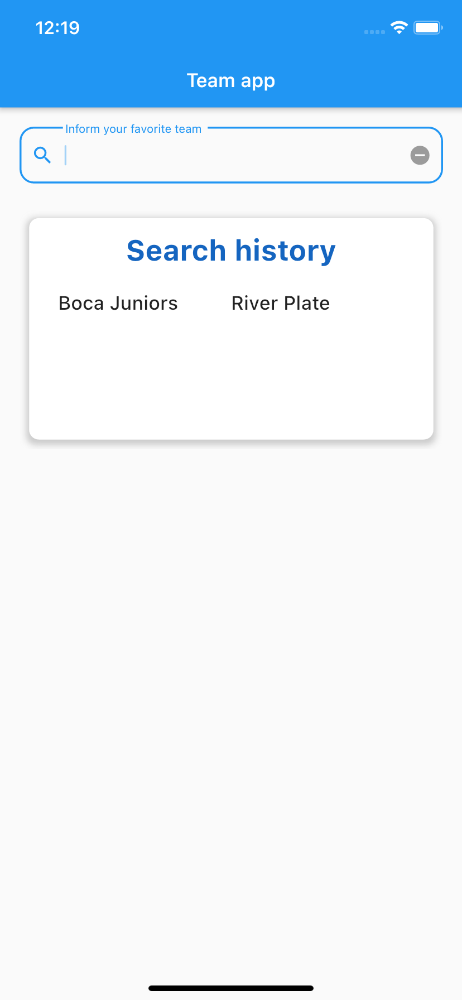
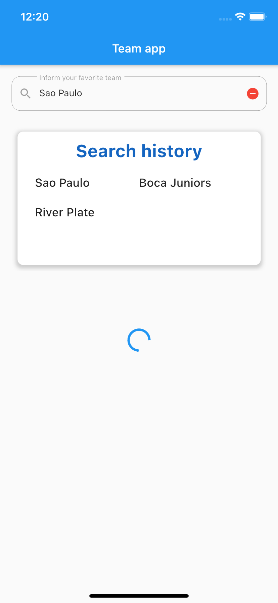
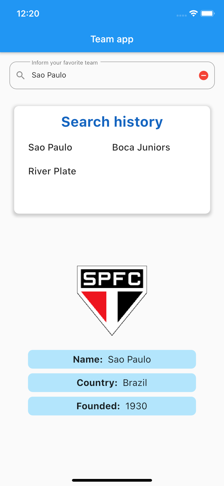
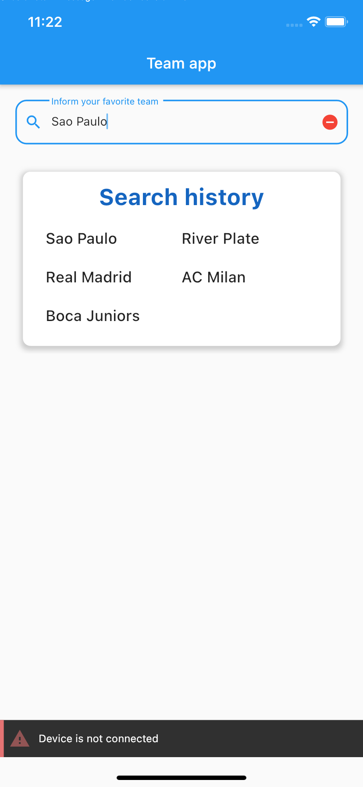
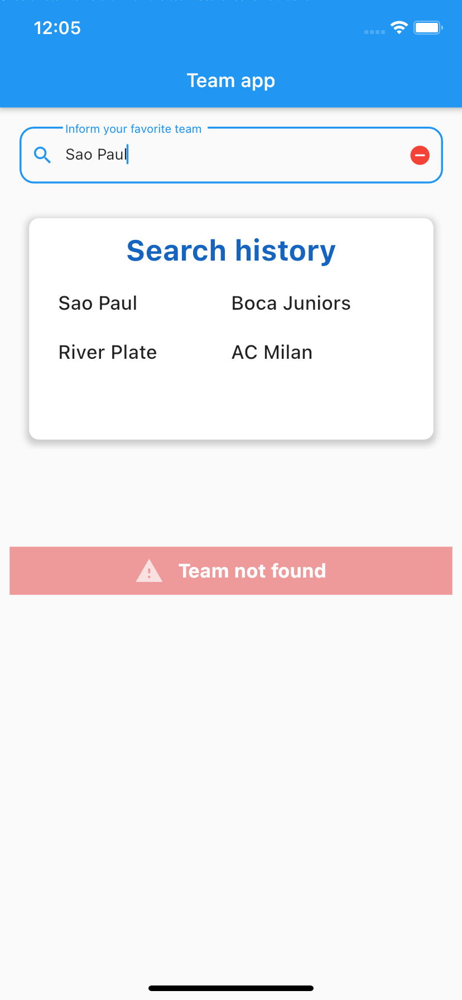

# Consulta de time de futebol usando o flutter, flutter_modular, flutter_bloc e arquitetura limpa

Aplicativo para a consulta de time de futebol. Ao digitar um time, o aplicativo realiza a busca e, em caso de sucesso, exibe as informações para o usuário. Caso contrário, é exibido o respectivo problema encontrado.

Este é um aplicativo bem simples, pois a ênfase não é o produto e sim a sua construção. A construção usou o framework flutter, pacotes como o flutter_modular, para injeção de dependência e rotas e o flutter_bloc para eventos e gerência de estados, além de outros pacotes. Por fim, uso de conceitos de arquitetura limpa e testes (incluindo testes de integração), apesar desses dois últimos serem redundantes.

Esse tutorial, no momento, não entrará em detalhes sobre os pacotes utilizados, nem sobre os conceitos de arquitetura limpa. A documentação dos pacotes encontra-se em <https://pub.dev/>. Sobre arquitetura limpa e código limpo, o conselho é a leitura dos livros homônimos do Robert Martin (Uncle Bob).

## Sucesso na consulta

Quando a consulta é realizada com sucesso, o aplicativo exibe os seguintes resultados:

- Escudo do time
- **Name:** nome do time encontrado. Nesse momento, como a consulta exige o nome exato do time de interesse (flexível apenas para maiúsculas e minúsculas), esse dado é simplesmente uma réplica da consulta do usuário. Em um futuro, caso a consulta trabalhe com termos (substrings), tratados na api ou no aplicativo, a exibição do nome exato do time encontrado já está pronto.
- **Country:** país de origem do time
- **Founded:** ano de fundação do time

<p
  float="left"
>
  
  
  
  
  
   
  
</p>

## Termos não aceitos

Alguns termos na busca não são aceitos, apresentando os seguintes erros:

- **Team cannot be empty:** não permite que o campo de texto esteja vazio
- **Team term is not valid:** somente caracters alfanuméricos e espaços são aceitos na pesquisa. Além disso, caracteres condizentes com a língua portuguesa, como as vogais e consoantes acentuadas e o ç também são aceitos. Caracteres especias como asterisco, cifrão, dentre outros não são aceitos. Talvez alguns times com nomes um tanto quanto excêntricos fiquem de fora da busca até que a validação tenha os devidos ajustes

<p
  float="left"
>
  
  
</p>

## Problemas na consulta

A consulta por um time de interesse pode apresentar os seguintes problemas:

**Server error:** algum erro não identificado na api utilizada
**Device is not connected:** desconexão ou alta latência de rede, impedindo que o dispositivo acesse a api
**Team not found:** o time de interesse não foi encontrado

Podemos classificar os dois primeiros items como problemas, propriamente dito. Problemas na api, estando inacessível por algum motivo (credenciais ou problemas de servidor) no caso do primeiro item. No segundo item temos problemas na internet (problemas técnicos na internet móvel, doméstica ou de trabalho), até mesmo uma distração do usuário que desabilitou qualquer tipo de acesso a internet do dispositivo. No último item não temos característicamente um problema, apenas a tentativa de encontrar dados de um time que não existe.

<p
  float="left"
>
  
  
  
</p>

## Histórico de buscas

A aplicação disponibiliza também um histórico com as 5 últimas buscas realizadas. Termos inválidos ou nulos não são contabilizados nesse histórico, pois a aplicação nem mesmo permite o envio da requisição. Quaisquer outros times pesquisados são adicionados nesse histórico, independente do resultado encontrado.


Se o usuário buscar um time que não esteja na lista e essa lista contiver o número máximo permitido, o histórico mais antigo é removido.


Caso a busca seja por um time que já esteja na lista, esse time mudará para a posição mais recente da lista. Além disso, essa busca pode ser facilmente realizada apenas clicando no time de interesse.


O time digitado interage com o histórico, servindo como filtro. Caso o campo de busca esteja vazio, a lista volta ao estado original


Caso não haja nenhum histórico, ou que o filtro não encontre nada, é exibida uma mensagem.


## Testes de integração

Testes de integração são testes realizados diretamente nos dispositivos e emuladores. Portanto, antes de executar os comandos abaixo, é necessário que algum dispositivo esteja conectado no computador, via usb por exemplo, ou que algum emulador esteja em execução. Os dispositivos e emuladores podem ser tanto de iOS quanto de Android.

- Testar as possíveis validações do campo de busca (vazio ou inválido).

```console
flutter drive --driver=test_driver/integration_test.dart --target=test_integration/team_search_validation_test.dart
```

- Testar os possíveis resultados obtidos (não encontrado ou os detalhes do time).

```console
flutter drive --driver=test_driver/integration_test.dart --target=test_integration/team_result_test.dart
```

- Testar os possíveis erros obtidos na busca (erro no servidor ou dispositivo não conectado).

```console
flutter drive --driver=test_driver/integration_test.dart --target=test_integration/team_result_error_test.dart
```

- Testar o histórico de busca (lista, filtro e erro)

```console
flutter drive --driver=test_driver/integration_test.dart --target=test_integration/search_history_result_test.dart
```

Para maiores detalhes consulte o pacote <https://pub.dev/packages/integration_test>

## API

<https://rapidapi.com/api-sports/api/api-football-beta?endpoint=apiendpoint_17386806-d0bb-4fc4-b0d8-7a4a035f437e>

## Credenciais de acesso

A api exige um cadastro para uso. Esse cadastro emitirá uma credencial de acesso. No momento da escrita desse tutorial, o cadastro e o acesso à api estão gratuitos, de acordo com as respectivas limitações do plano.

No entanto, nada impede que futuramente ocorram mudanças quanto a sua gratuidade, sendo necessário atualizações no cadastro para satisfazer tais mudanças. Com isso, é provável que a credencial esteja inválida, até que tais atualizações estejam devidamente concluídas, podendo acarretar em erros de difícil compreensão e correção a quem fez o download e quer executar o aplicativo em um primeiro momento.

Por isso, a credencial de acesso não estará disponível no repositório, sendo necessário, antes de mais nada, o cadastro na api para obter a sua credencial. Essa credencial precisa ser colocada em **config/app_config.json**, na chave **apiKey**.
